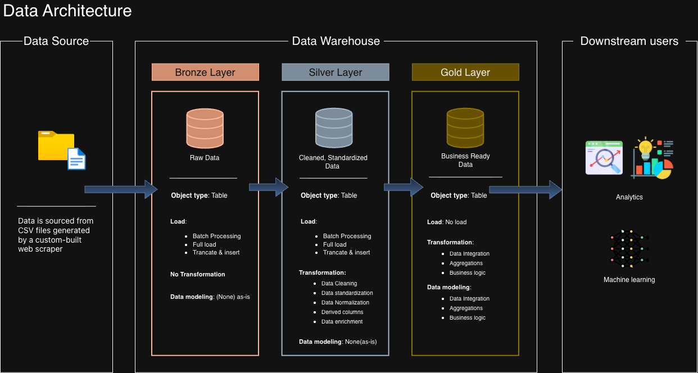
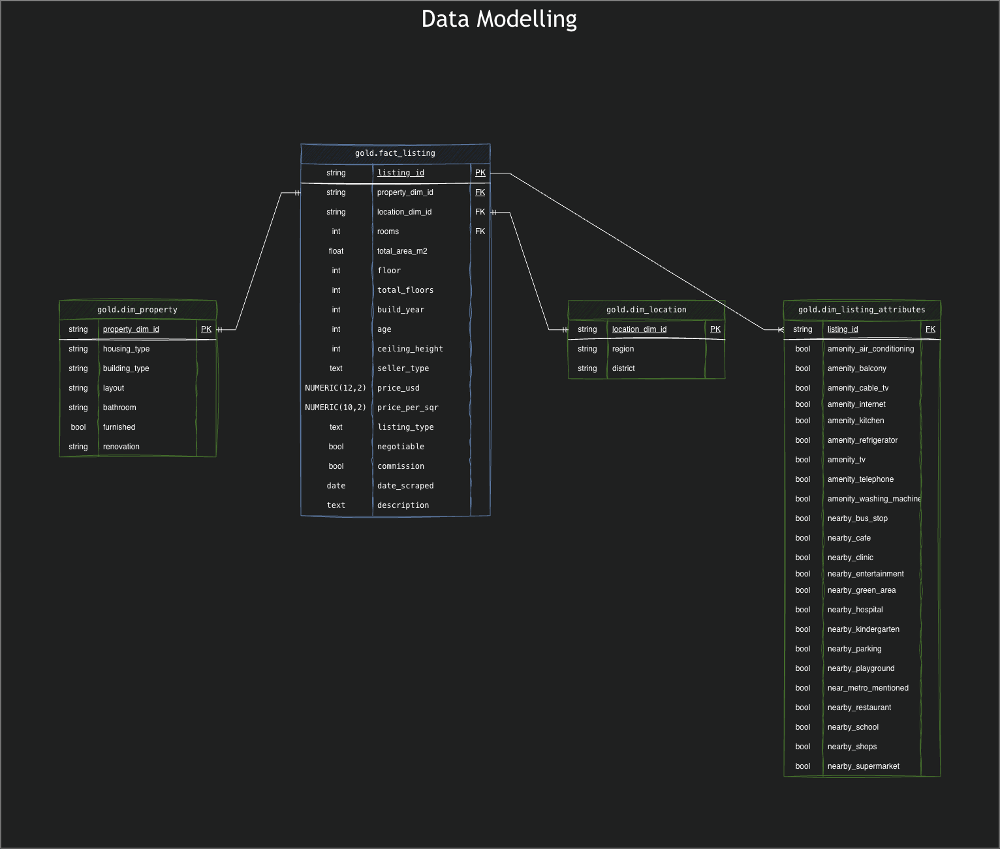

# Project Requirements
 
**Objective**: Build a reliable, scalable data warehouse in PostgreSQL that
gives stakeholders a trusted, centralized data model for analysis and
reporting.
 
**Scope**:
- Source: CSV files from a custom web scraper — one row per apartment listing
- Only the latest dataset is maintained; no historical versioning
- Single source, no integration with other systems
- Documented clearly enough for business stakeholders and analysts to use independently
## Analytics & Reporting
 
**Objective**: SQL-based queries delivering actionable insights, covering:
 
- Floor level's impact on price
- Most affordable districts
- Metro proximity's impact on price, by room count
- Top 10 most common apartment sizes and room counts
- Building type's impact on price
- Price distribution by seller type

## Repository Structure

```text
DataWarehouse/
├── charts/               # Charts & Insights
├── dataset/              # Source CSV data
├── docs/                 # Diagrams and project documentation
├── scripts/              # SQL scripts for the data warehouse
│   ├── bronze/           # Raw data layer
│   ├── silver/           # Cleaned and transformed data layer
│   └── gold/             # Final analytics layer
├── tests/                # SQL checks for data loading and quality
├── README.md             # Project overview
└── LICENSE               # Project license
```

Main files:
- `scripts/init_database.sql` creates the database setup.
- `dataset/database.csv` contains the apartment listing data.
- `docs/` contains ERD and architecture diagrams.

Charts: [check out my findings](charts)  
**Note on charts:** The visualizations in this folder were generated with pandas during early data exploration, before the warehouse's bronze/silver/gold pipeline was finalized. They're kept here as a record of that initial exploratory pass, but the numbers may not reflect later data-quality fixes (e.g. price correction, deduplication) applied in the SQL layer. For up-to-date analysis, see the SQL queries in analytics/ run against gold.vw_listing_report.

## Technologies
- SQL
- PostgreSQL
- Pandas
- Data Modeling
- Git & GitHub
- Draw.io
## Data Architecture 

## Data Modeling (gold)


## About Me

Hi, I'm, Javohir Eshonov, a data enthusiast interested in data engineering, SQL, PostgreSQL,
and building useful analytics solutions. This project shows my understanding
of data warehouse design, medallion architecture, data modeling, and data
quality checks.

You can connect with me here:
- LinkedIn: [linkedin.com/in/javohir-eshonov/](https://www.linkedin.com/in/javohir-eshonov/)
- Email: [eshonovjavohir92@gmail.com](mailto:eshonovjavohir92@gmail.com)
